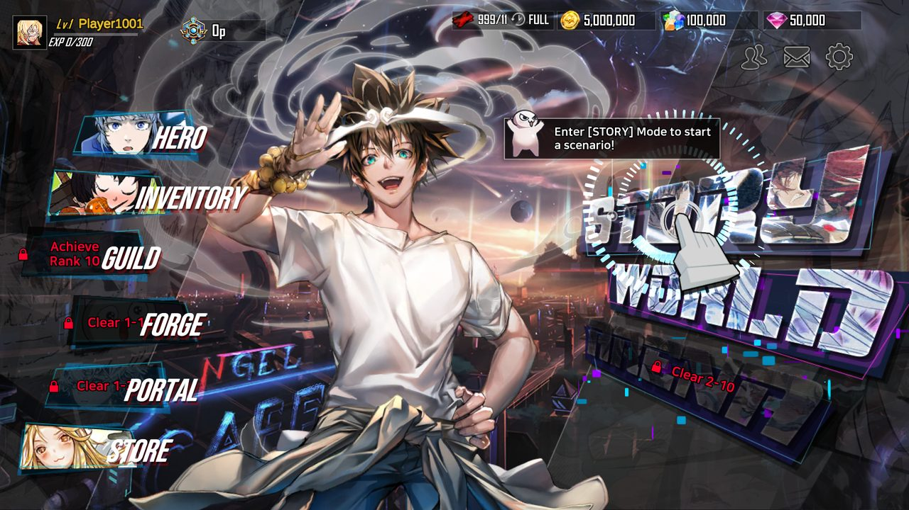
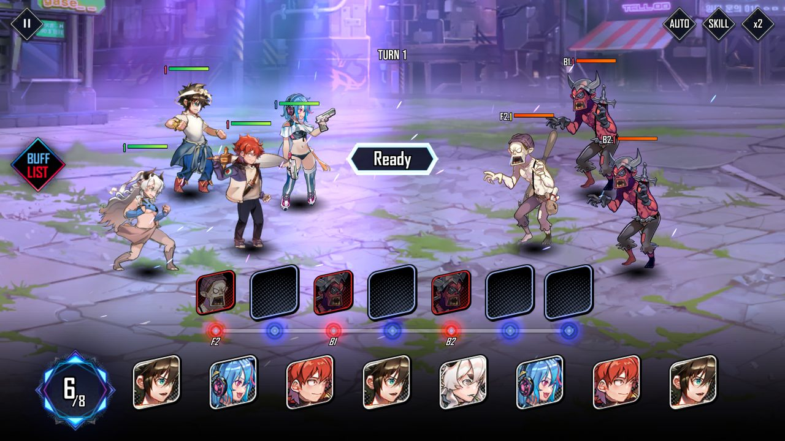

# Heroic Chant

A private server for **Hero Cantare**, the gacha game that shut down in 2023.
The name's a pun — *cantare* is "to sing", so: heroic chant. Close enough.

This is a server the original client talks to, so the game runs again.

It's not a remake or an emulator wrapper. It's the actual 1.2.389 Android
client, unmodified, connecting to Python running on your machine. You log in,
you get your heroes, you play the story, stages pay out, gear works.



## Does it actually work

Yeah. Everything below has been tested against the real client, not just unit
tests:

- login, lobby, the full 138-hero roster
- story stages: turn-based combat, rewards, star flags, unlocking the next one
- progression that survives a relogin
- hero rarity (A / S / SS / SSS)
- level up, star-up (shards + memory stones), the awakening skill tree
- equipment: equip, auto-equip sets, upgrade, sell, runes
- City Search, the idle farm, with a working Claim button
- summoning heroes at the real drop rates
- guilds (founding, donations, buffs, the exchange shop)



Not done: PvP, raids, guild wars. Anything that needs other players, basically.
The shop works server-side but the Store screen only renders its Costume tab.
The gacha grants heroes correctly but the result screen doesn't close itself —
close and reopen and your new hero is there.

**58 of 401 client packets have handlers.** The other 343 decode fine and get
logged with their arguments when they show up, they just don't do anything yet.
That's the main thing to work on if you want to help.

## Running it

You need your own copy of the game. See [Legal](#legal).

```bash
pip install -r requirements-dev.txt   # only needed for the tools
python tools/gen_protocol.py --apk /path/to/herocantare.apk
python tools/extract_assets.py
```

That builds the two things that aren't in the repo: the packet definitions and
the game's data tables. Then:

```bash
python tools/selftest.py     # drives a fake client through the whole stack
python -m hc.main --public-host 192.168.1.50
```

Getting a phone or emulator to actually connect is its own thing —
[docs/TESTING.md](docs/TESTING.md) walks through it. Short version: the client
does an HTTP call before it opens a socket, and `tools/bootserver.py` answers
it and tells the client where your server lives.

If you're on the emulator setup already, `python tools/resume.py` brings
everything back up in one go.

## How it works

The protocol wasn't guessed. Every one of the **859 packets** and **180 wire
structs** came out of disassembling the marshalling functions in
`libil2cpp.so`, and each one is cross-checked against its declared signature.
859 out of 859 agree. `tools/gen_protocol.py` regenerates the whole spec from
an APK and reproduces it byte for byte.

That mattered more than expected, because field order on the wire is *not* the
order fields are declared. `NGPartyInfo` declares five and the client writes
four, silently skipping `UnitID`. Build a server off the class layout and every
field after that one lands in the wrong slot.

The game data was never missing either, which is what most people assume when
they look at this game. 172 tables sit in `herocantare.db` and another 252 are
plain JSON inside the AssetBundles: 7,123 stages, 36,797 reward rows, monster
stats, shop, missions, arena AI. Even the story text is there.

[docs/PROTOCOL.md](docs/PROTOCOL.md) has the whole wire format with the
addresses to check every claim against.

## Want to help

Read [CONTRIBUTING.md](CONTRIBUTING.md). It has a worked example of adding a
packet handler start to finish, which is most of what there is to do.

The short pitch: run the server with `--log-level DEBUG`, play, and watch for

```
C2S GameServerC2S.SomeThingReq -- no handler (24 body bytes)
```

That's the todo list, in the order the game actually needs things. The codec
already exists for every one of them, so a handler is usually ten lines.

## Legal

The server is mine and you can do what you want with it. The game isn't.

No game assets, data tables, packet definitions or APK are in this repo, and
they shouldn't be added. `.gitignore` blocks the obvious ones. The tools rebuild
all of it from a copy of the game you supply yourself.

Don't ship a repacked APK with this. Ship the server and let people point their
own client at it.

## Docs

| | |
|---|---|
| [CONTRIBUTING.md](CONTRIBUTING.md) | setup, layout, how to add a feature |
| [docs/PROTOCOL.md](docs/PROTOCOL.md) | the wire format, with evidence |
| [docs/TESTING.md](docs/TESTING.md) | getting a device connected |
| [docs/STATUS.md](docs/STATUS.md) | running log of what's been built and what broke |
